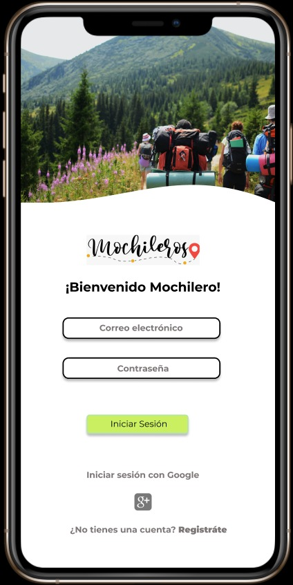

# Creando una Red Social

Live: https://verosilva.github.io/LIM013-fe-social-network/src/

## Índice

- [1. Preámbulo](#1-preámbulo)
- [2. Resumen del proyecto](#2-resumen-del-proyecto)
- [3. Definicion de usuario](#3-definicion-de-usuario)
- [4. Definicion del producto](#4-definicion-del-producto)
- [5. Resumen de feedback](#5-resumen-de-feedback)
- [6. Construido con](#6-construido-con)
- [7. Autores](#7-autores)

## 1. Preámbulo

Ya no existe una sociedad sin internet, en el entorno actual el internet nos ha permitido mantenernos conectados diariamente con amigos y familiares.
Y este vinculo se fortalece por medio de las redes sociales las cuales brindan un entorno virtual para mantener conexiones con personas que tienen intereses en comun. Hoy las redes sociales le dan el protagonismo a los usuarios y a las comunidades que estos conforman.
Estos sitios facilitan la comunicacion entre personas, el intercambio de informacion (fotos, videos y comentarios) y estos nos permiten conocer gente nueva, ampliando aun mas nuestra red.

## 2. Resumen del proyecto

El presente proyecto **Mochileros** es una red social destinada a un publico apasionado por viajar y aventurarse, interesados por compartir sus experiencias y tener nuevas conexiones con otras personas. Esta comunidad de viajeros se nutre de las experiencias de cada uno basadas en viajes con bajos presupuestos, rutas, hospedajes, promociones, etc de cierto lugar dandole protagonismo a los usuarios y a las comunidades que estos conforman.
Esta red social permite que cualquier usuario mochilero pueda crear su cuenta de acceso o iniciar sesion con su cuenta de Google y pueda con ella crear, editar y eliminar sus publicaciones de sus experiencias viajando, ademas podra actualizar su perfil.

## 3. Definición de usuario

El Mochilero se caracteriza por ser de corazon aventurero, es apasionado por vivir nuevas experiencias, no tiene problemas con viajar con bajo presupuesto, se caracteriza por ser sociable; le gusta compartir sus experiencias con amistades. Tiene entre 25 años y 35 años.

## 4. Definicion del producto

La app para Mochileros da una nueva oportunidad dentro de la situación excepcional de la pandemia, donde se ve perjudicado el presupuesto y la libertad de viajar. Esta aplicación conecta a viajeros de diversas comunidades, a fin de servir de puente comunicacional, acerca de los lugares activos, que cumplan con los requerimientos esenciales de seguridad e higiene.

## 4.1 Prototipos

## 6. Construido con:🛠️

- Javascript Vanilla
- Jest
- Firebase
- CSS

## 7. Autores 🎁

- Verónica Silva [Repositorio](https://github.com/VeroSilva?tab=repositories)
- Katherin Moreno [Pespositorio](https://github.com/KatLMD?tab=repositories)
- Estefania Moncada [Pespositorio](https://github.com/Estefaniamr1?tab=repositories)